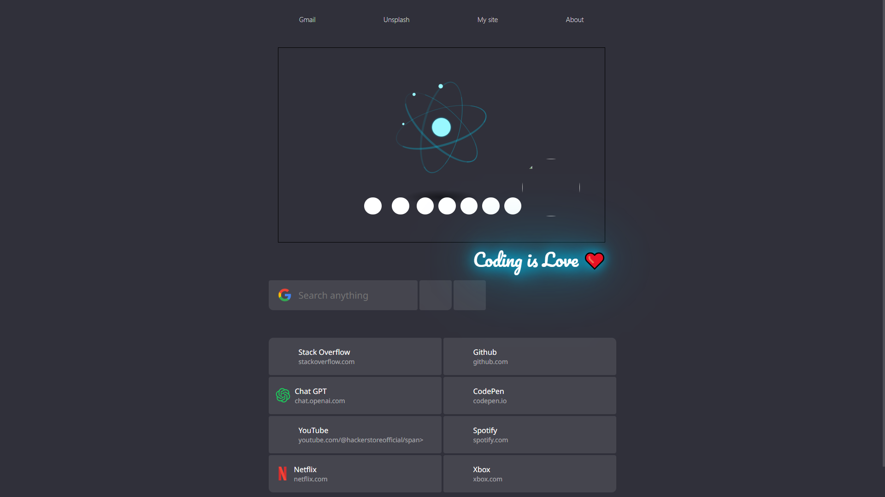

# 🌐 Chrome Homepage

[](#)
[](#)
[](LICENSE)
[](https://github.com/hackerstoreofficial/Chrome-Homepage/stargazers)
[](https://github.com/hackerstoreofficial/Chrome-Homepage/network/members)

A customized **Chrome Homepage** built with HTML & CSS for a clean, minimal, and modern browsing experience.  
This project gives your Chrome new tab a refreshing look with simplicity and personalization.

---

## 📸 Preview



---

## ✨ Features
- 🖼️ **Minimal Design** — distraction-free browsing experience  
- 🎨 **Custom CSS Styling** — neat typography and layout  
- ⚡ **Fast & Lightweight** — no external dependencies, pure HTML & CSS  
- 🛠️ **Easy to Customize** — update colors, fonts, and links to your preference  

---

## 🚀 Getting Started

### 1) Clone the repository
```bash
git clone https://github.com/hackerstoreofficial/Chrome-Homepage.git
``` 

### 2) Open in Browser

2.1 Go to the Chrome-Homepage folder<br>
2.2 Open index.html in your preferred browser

### 3) Set as Chrome Homepage (Optional)

3.1 Open Chrome Settings → On startup  <br>
3.2 Select Open a specific page or set of pages <br>
3.3 Choose the local path of your index.html file <br>
3.4 Restart Chrome 🚀

---

## 🛠️ Tech Stack
**HTML5** <br>
**CSS3**

---

## 📂 Project Structure

```bash
Chrome-Homepage/
│── index.html
│── style.css
└── .assets/
    └── 1.png   # Screenshot
```

---

## 📌 Future Improvements
🌗 Add Dark/Light mode toggle <br>
⏰ Option to show live time & date<br>
🔗 Quick links to favorite websites

---

## 🤝 Contributing
Contributions are welcome! Feel free to fork this repo and submit pull requests.

---

## 📄 License
[](LICENSE)
This project is licensed under the **MIT License** — free to use and modify.

---

## ✨ Author
**Devesh Kumar**
