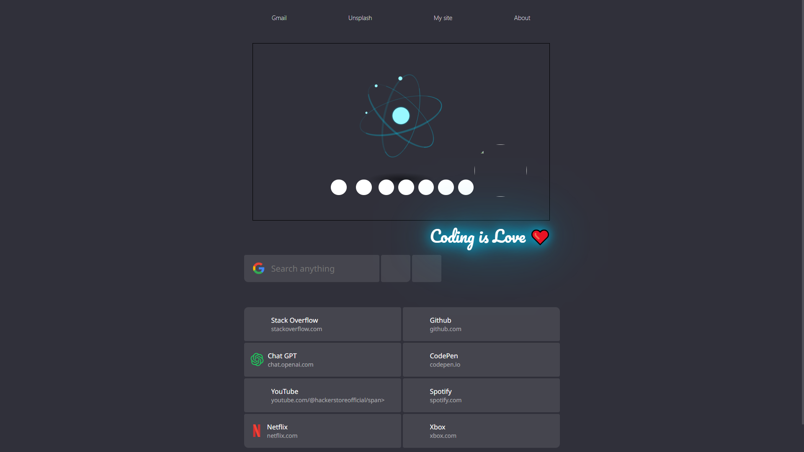

# 🌐 Chrome Homepage

A customized **Chrome Homepage** built with HTML & CSS for a clean, minimal, and modern browsing experience.  
This project gives your Chrome new tab a refreshing look with simplicity and personalization.

---

## 📸 Preview



---

## ✨ Features
- 🖼️ **Minimal Design** — distraction-free browsing experience  
- 🎨 **Custom CSS Styling** — neat typography and layout  
- ⚡ **Fast & Lightweight** — no external dependencies, pure HTML & CSS  
- 🛠️ **Easy to Customize** — update colors, fonts, and links to your preference  

---

## 🚀 Getting Started

### 1. Clone the repository
```bash
git clone https://github.com/hackerstoreofficial/Chrome-Homepage.git

